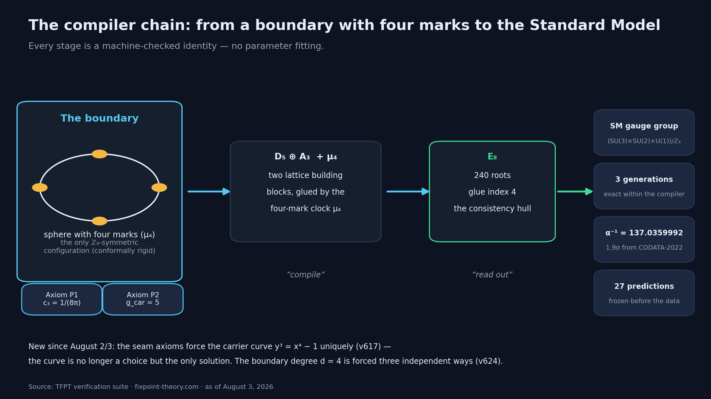
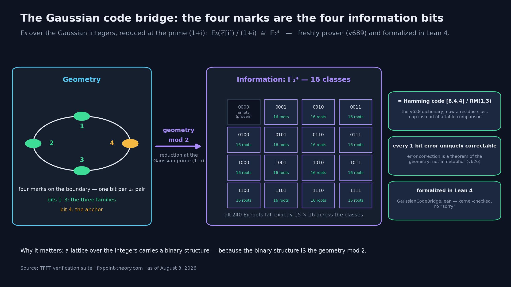
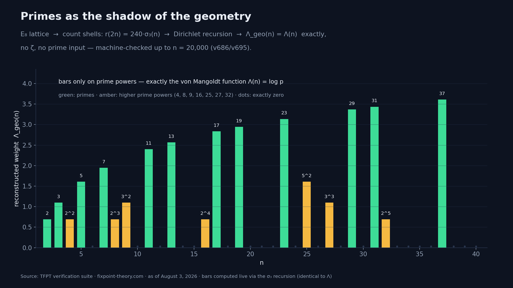
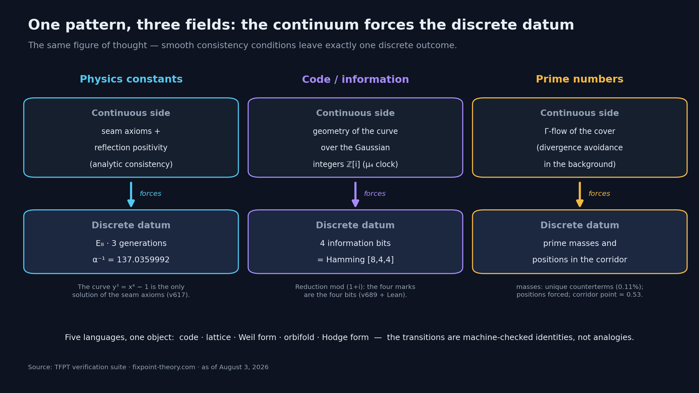
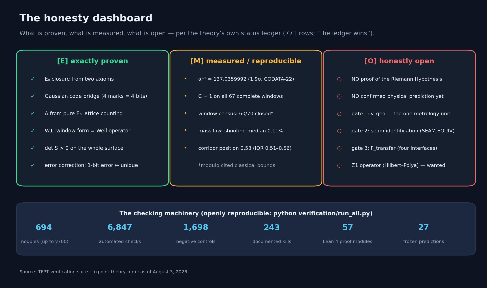

# What Happens When You Read the Universe as a Compiler

*A theory that builds the Standard Model from two axioms found something unexpected along the way: an error-correcting code, the prime numbers — and one pattern connecting all three. A progress report, including the list of what remains open.*

---

Imagine someone claims: the constants of nature are not an accident and not fine-tuning. They are what a very small, very stubborn compiler prints when you feed it exactly two inputs.

You would raise an eyebrow, and rightly so. Which is why this piece does not open with the claim — it opens with the checking machinery. Everything below is machine-verifiable in an open verification suite: 694 Python modules, more than 6,800 automated checks, plus formal proofs in Lean 4. And the theory keeps a public ledger of what it **cannot** do. More on that at the end.

First, the story.

## A boundary, four marks, two numbers

The theory is called TFPT (*Topological Fixpoint Theory*), and its entire starting configuration fits into one sentence: the surface of a sphere with **four marked points** and **two axioms** — a boundary constant `c₃ = 1/(8π)` and a carrier rank `g_car = 5`.

That is the whole input. No 19 free parameters like the Standard Model of particle physics. Two numbers and a π.

From this input, nothing gets "modeled" and nothing gets "fitted." It gets **compiled**: the way a compiler deterministically turns source code into a program, a chain of exact mathematical identities turns the two axioms into an intermediate object — and turns the intermediate object into physics.

The intermediate object is an old acquaintance of mathematics: **E₈**, the most exceptional lattice in eight dimensions, with exactly 240 shortest vectors ("roots"). The compiler assembles it from two lattice building blocks (D₅ and A₃), glued together by the four-mark symmetry μ₄. And from E₈ the readouts follow: the gauge group of the Standard Model, exactly three particle generations, and a fine-structure constant of α⁻¹ = 137.0359992 — within 1.9 standard deviations of the measured value (CODATA 2022), with no dial anywhere that anyone could have turned.

For a long time, this story had one honest weakness: why *this* starting configuration? That changed in the past few days. It is now machine-proven that the consistency conditions at the boundary (the "seam axioms") **force the underlying geometry uniquely** — the curve `y³ = x⁴ − 1` on which the compiler lives is not a lucky choice but the only solution. The number four is not a taste either: three independent selection theorems force it.

So much for the origin story. Now for the things nobody ordered.

## Surprise 1: E₈ is literally an error-correcting code

If you have ever heard that the universe is "like a computer," you know it as a metaphor. Here it is not one.

E₈ can be constructed from one of the most famous objects in information theory: the extended **Hamming code [8,4,4]** — the code whose relatives fix bit errors in every RAM chip. That much has been mathematical folklore since the 1960s. What is new is what the suite made of it: it proved that every single-bit error in this code is uniquely correctable, that decoding is literally a geometric projection — and above all, **why** a lattice over the integers carries a binary structure at all.

The answer is the most beautiful single discovery of the past days, the **Gaussian code bridge**: take E₈ over the Gaussian integers ℤ[i] (the complex numbers with integer coordinates) and reduce at the Gaussian prime (1+i) — what remains is exactly a four-dimensional binary space: 𝔽₂⁴, four bits.

And these four bits are not just any four bits. They correspond one-to-one to the **four marks from the beginning of the story**: three bits for the three particle families, one for the anchor. The 240 roots of E₈ distribute exactly 15 × 16 across the classes, the zero class is provably empty, and the compiler's family symmetry acts on the bits precisely as the permutation of the three family bits.

In one sentence: **the binary structure is the geometry mod 2.** No more comparing two tables — a residue-class map. The result is freshly proven (module v689, 26 checks) and already formalized in Lean 4 — checked by the proof kernel, without a single `sorry`.

## Surprise 2: primes as the shadow of the geometry

The second surprise begins with an innocent question: what does the counting function of E₈ actually count — the function that says how many lattice points sit on each spherical shell?

The answer is a classical modular form, and inside it lives a mechanism. You can feed a recursion with nothing but the raw **shell counts** — literally: counting points — and out falls the von Mangoldt function Λ(n): the object of number theory that lives exactly on prime powers and carries the weight log p there.

No ζ, no prime input, no circularity — the suite has certified the identity `Λ_geo = Λ` exactly up to n = 20,000 (the bar chart above was computed live for this article with the very same recursion). To be honest about it: the identity behind this is a theorem of Hecke from classical mathematics. The substance is the *direction* it pins down: **geometry first, primes second.** The primes do not enter as building blocks here — they emerge as a readout of the finished counting function. As a shadow.

And it goes further. On August 3, a probe series showed that a pure "flow" — an analytic background that comes literally from the compiler geometry — *would* run into a singularity at every upcoming prime-power slot, and that exactly the prime masses are the unique stabilizing counterterms. Via a shooting method, the flow reconstructs the masses to a median of 0.11% — and the *positions* of the prime powers cannot be imitated by alternatives either. The bare flow, without a single piece of arithmetic input, even "knows" log 2 to a few parts per thousand.

The honest limit stands right next to it, as a frozen verdict in the suite: **verifier, not generator.** The flow checks the prime comb slot by slot with brutal sharpness, but it does not dictate it autonomously into the future — after 2–4 steps, any position error amplifies by a factor of 5 to 12. That, too, is measured and documented.

## The one pattern

Which brings us to the big picture. Three fields that should have nothing to do with each other — constants of nature, coding theory, prime numbers — show the same figure of thought:

**The continuum forces the discrete datum.**

- In **physics**: smooth consistency conditions (seam axioms, reflection positivity) leave exactly one discrete outcome — E₈, three generations, one specific number for α.
- In the **code**: the continuous geometry of the curve, read mod 2, *is* the four-bit code. Error correction is not a design decision but a theorem.
- In the **primes**: the continuous flow forces the discrete prime comb as the only stable continuation.

If you know Eugene Wigner's famous question — why is mathematics so "unreasonably effective" in physics? — you may recognize a possible inversion here. Perhaps the question is posed backwards. If the same geometric object is simultaneously a code, a lattice, an energy computation and a prime machine — and the transitions between these descriptions are machine-checked identities, not analogies — then the effectiveness is not a miracle. It is bookkeeping: five languages, one object.

The fine-tuning debate takes on a different color in this picture, too. Constants that are *forced* cannot be detuned. And a universe whose basic structure is an error-correcting code would come with built-in robustness — a "code without leaks": every single-bit error has a unique nearest valid configuration. Whether this error correction plays a *dynamical* role, however, is precisely one of the questions the theory itself lists as open.

## The honesty section — the most important part of this article

Any theory of this scope deserves maximum suspicion. Which is why the most remarkable thing about TFPT is not any single formula, but the discipline architecture around it.

What is **not** being claimed here:

- **No proof of the Riemann Hypothesis.** The theory works at the prime front (a separate article covers this), but its own verdict is stated verbatim in the documents: the hard core of the conjecture has not been moved by any of the measurements.
- **No confirmed physical prediction yet.** There are 27 falsifiable predictions, frozen *before* the data arrived — for instance a cosmic birefringence of β ≈ 0.24°, which CMB polarimetry experiments will decide within the next few years. None has been decided yet.
- **Three named gate problems** remain open: the theory's one unit of measurement (`v_geo` — why does the world have a scale?), the identification of the physical seam with the constructed network (`SEAM.EQUIV`), and the transfer interfaces to quantities like the proton–electron mass ratio (`F_transfer`).

And what the strength is: **falsifiability plus machine checking.** Every load-bearing statement has a script, every script has a row in the status ledger (771 rows), and the ledger also records the **243 buried hypotheses** — ideas that were tested and died, kept by name instead of silently deleted. 1,698 negative controls verify, corpus-wide, that the machinery really does break on scrambled data. One sign-reading error was found by the suite itself and documented the same day as a dated erratum.

You can recompute all of it yourself. One `git clone`, one `python run_all.py`, roughly four minutes — and your own machine says `ALL CHECKS PASSED`. Or it doesn't.

## Why this stays interesting, whichever way it goes

Maybe TFPT turns out to be wrong. Then it has named 27 precise places where it can be killed — and left behind a methodology for keeping speculative theories honest with machine bookkeeping.

Maybe it turns out to be right. Then the constants of nature, error correction and the primes are three readouts of a single object — and the question "why these numbers?" would, for the first time, have an answer you can compile.

Either way: this is not a physics of claims, but a physics of test protocols. That alone is worth a look.

---

**Check it yourself:**

- Website with interactive explanations, status overview and in-browser reproducer: [fixpoint-theory.com](https://www.fixpoint-theory.com)
- Open code + verification suite: [github.com/sthamann/tfpt](https://github.com/sthamann/tfpt)
- Archived, citable version: [Zenodo, DOI 10.5281/zenodo.20846087](https://doi.org/10.5281/zenodo.20846087)

*Questions, objections and falsification attempts are explicitly welcome — that is exactly what everything is open for.*

---

## LinkedIn summary (~200 words)

What happens when you read the universe as a compiler?

A research program called TFPT starts with two axioms — a boundary constant and a carrier rank — and compiles the Standard Model from them via the E₈ lattice: the gauge group, three generations, α⁻¹ = 137.0359992. No fit, no free parameters.

Along the way, three things happened that nobody ordered:

1. E₈ is literally an error-correcting code — and as of this week it is proven why: the geometry mod 2 *is* the code. The four marks of the starting configuration are the four information bits. Formalized in Lean 4.
2. The von Mangoldt function of the primes can be reconstructed exactly from pure lattice counting — primes as the shadow of the geometry.
3. A geometric flow forces the masses and positions of the prime powers as unique stabilizers.

One pattern, three fields: the continuum forces the discrete datum.

Equally important: what does NOT hold. No RH proof. No confirmed physical prediction. Three named open gate problems. In exchange: 694 verification modules, >6,800 checks, 27 frozen falsifiable predictions, 243 documented dead hypotheses — all openly reproducible.

Details, figures and test protocols: fixpoint-theory.com
