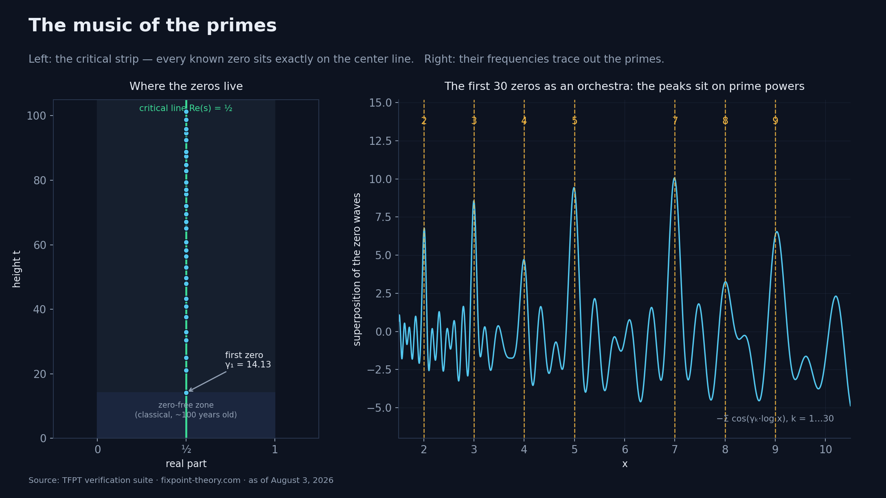
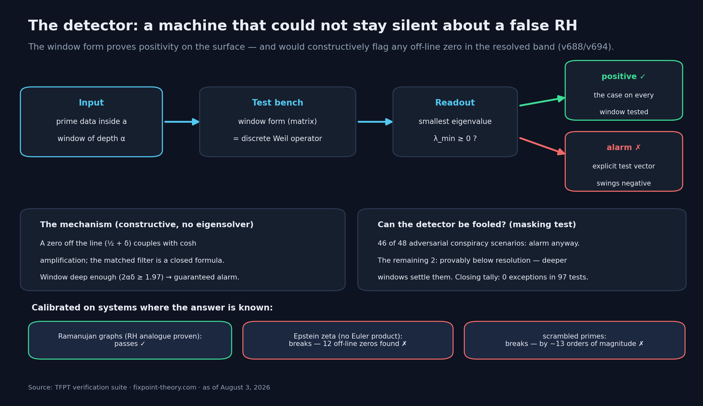
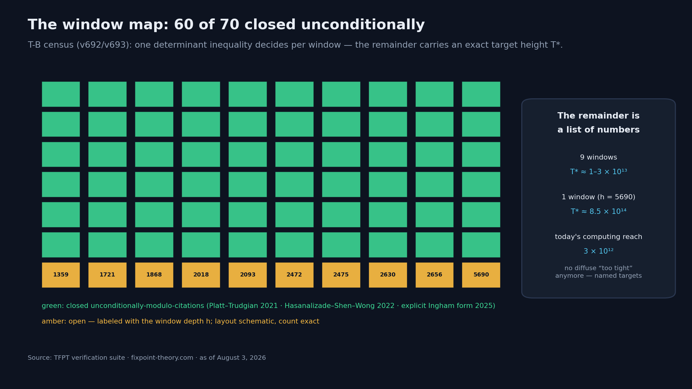
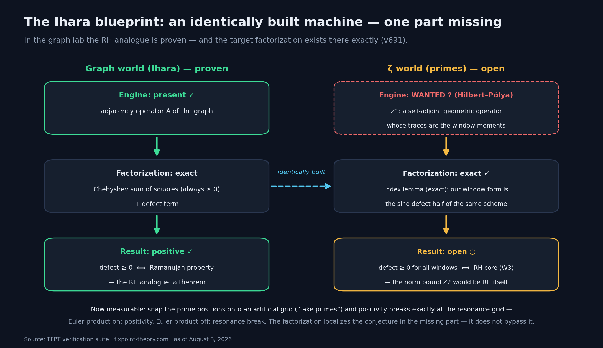
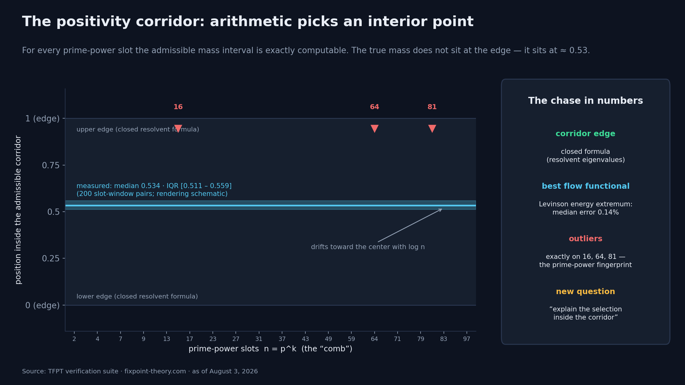
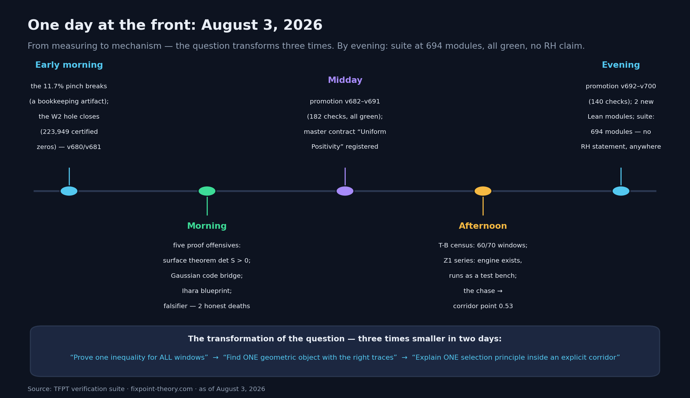

# Die Primzahl-Front: Wie eine Physik-Theorie an der Riemann-Hypothese arbeitet

*Ein Protokoll vom 3. August 2026 — dem Tag, an dem zwei Flächensätze fielen, eine baugleiche Beweismaschine gefunden wurde und die älteste offene Frage der Mathematik dreimal kleiner wurde. Vorweg, damit kein Missverständnis entsteht: Die Riemann-Hypothese ist am Ende dieses Textes immer noch unbewiesen.*

---

## Die Musik der Primzahlen, in zwei Absätzen

Primzahlen wirken wie Chaos: 2, 3, 5, 7, 11, 13 … kein erkennbarer Takt, keine Formel, die die nächste verrät. Bernhard Riemann zeigte 1859, dass sich hinter diesem Chaos eine perfekte Ordnung verbergen könnte: Die Verteilung der Primzahlen wird vollständig von den Nullstellen einer einzigen Funktion gesteuert — der Zetafunktion. Jede Nullstelle ist wie ein reiner Ton. Überlagert man alle Töne, zeichnen die Schwingungen exakt die Primzahlen nach. Man kann das heute auf jedem Laptop hören, beziehungsweise sehen:

Riemanns Vermutung besagt: Alle diese Töne sind *rein* — alle Nullstellen liegen exakt auf einer Mittellinie. Milliarden wurden nachgerechnet, alle liegen dort. Bewiesen ist es für keine unendliche Gesamtheit. Seit 166 Jahren ist das die vielleicht wichtigste offene Frage der Mathematik, mit einer Million Dollar Preisgeld und einem Friedhof gescheiterter Anläufe.

An dieser Front arbeitet — von einer unerwarteten Seite kommend — eine Physik-Theorie: TFPT, die das Standardmodell aus zwei Axiomen „kompiliert“ (die Hintergrundgeschichte steht in einem eigenen Artikel). Ihre Primzahl-Arbeit begann als Nebenprodukt und wurde zum eigenen Forschungsprogramm. Hier ist der Stand — und er ist ungewöhnlich genau beziffert.

## Der Weg: Aus dem Werkzeug wurde ein klassischer Operator

Die Theorie rechnet seit Monaten mit „Fenstern“: endlichen Ausschnitten der Primzahl-Daten, verpackt in eine Matrix (die *Fensterform*). Die praktische Beobachtung: Diese Matrizen sind immer positiv — ihre kleinsten Eigenwerte bleiben über null. Das wäre eine Kuriosität, wenn nicht Anfang August etwas Merkwürdiges aufgefallen wäre: Die hauseigene „Atomtabelle“ der Fensterform ist **Wort für Wort identisch** mit dem Prim-Maß eines aktuellen operatortheoretischen Zugangs zur Riemann-Hypothese (Suzuki 2026), der wiederum auf André Weils klassischem Rahmen von 1952 aufbaut.

Aus der Koinzidenz wurde ein Satz: Die Fensterform *ist* eine Diskretisierung des klassischen Weil-Operators — das Wörterbuch zwischen beiden ist ein einziger hergeleiteter Skalar, kein Fit. (Nebenbei ein Lehrstück in Ehrlichkeit: Die erste Version dieses Wörterbuchs enthielt eine Vorzeichen-Fehllesung einer Formel aus dem zitierten Paper. Gefunden hat den Fehler die eigene Verifikationssuite, am selben Tag, dokumentiert als datiertes Erratum — und das korrigierte Wörterbuch war *einfacher* als das falsche.)

Damit war klar, woran hier eigentlich gearbeitet wird: Die Positivität dieser Fensterformen, gleichmäßig über alle Fenster, ist eine bekannte Formulierungs-Variante der Riemann-Hypothese selbst. Kein Spielzeug. Die Wand.

## Der Detektor: eine Maschine, die eine falsche RH nicht verschweigen könnte

Das Erste, was man von einem ernsthaften Messprogramm verlangen muss: Es darf nicht nur bestätigen können. Es muss brechen können.

Genau das leistet die Fensterform nachweislich. Eine Nullstelle abseits der Mittellinie würde in der Form mit exponentieller Verstärkung koppeln — und seit dem 3. August gibt es dafür einen **konstruktiven Falsifikator**: eine geschlossene Formel (einen „Matched Filter“), die aus einer hypothetischen Off-Line-Nullstelle direkt einen Testvektor baut, der negativ ausschlägt. Sobald das Fenster tief genug ist, ist der Ausschlag garantiert; die Schwelle ist explizit (2αδ ≥ 1,97). Auch Verschwörungs-Szenarien — mehrere Störer, die sich gegenseitig maskieren — sind durchgetestet: 46 von 48 brechen trotzdem, die restlichen zwei liegen beweisbar unterhalb der Auflösung, und die Abschluss-Bilanz des zugehörigen Lemmas lautet null Ausnahmen in 97 Tests.

Und der Detektor ist kalibriert, an Systemen, wo man die Antwort kennt:

- **Ramanujan-Graphen** — endliche Netzwerke, für die das RH-Analogon *bewiesen* ist: Der Detektor bestätigt sie.
- **Epstein-Zetafunktionen** — Funktionen, die der Zetafunktion ähneln, aber kein Euler-Produkt haben und nachweislich Nullstellen abseits der Linie besitzen: Der Detektor findet exakt 12 davon im Hauptfenster, und die Positivitäts-Maschinerie bricht um rund 13 Größenordnungen.
- **Verwürfelte Primzahlen**: bricht ebenfalls.

Eine Maschine, die bei falschen Welten zuverlässig Alarm schlägt und bei der echten schweigt, misst etwas Echtes.

## Die zwei Flächensätze vom 3. August

Bis hierher war alles Messung. Der 3. August brachte zwei Aussagen von anderer Qualität — Sätze auf der gesamten eingesetzten Fenster-Familie, ohne unbewiesene Annahmen.

**Erstens, das Vorzeichen — unbedingt.** Der gesamte Primzahl-Einfluss auf den tragenden Block der Fensterform presst sich in drei lineare Funktionale zusammen, und deren Determinante ist nachweislich positiv, auf allen 67 vollständigen Fenstern der Fläche. Der Beweis kombiniert exakte Algebra, eine explizite Formel und genau zwei klassische Zitate. Der Kern lässt sich ohne jede Formel erzählen: Die Fensterform hat „gefährliche Störfrequenzen“ um 0,6 bis 1,3 — eine Zeta-Nullstelle genau dort würde sie kippen. Aber die tiefste Zeta-Nullstelle liegt bei 14,13, und dass darunter *nichts* ist, weiß die Mathematik seit rund hundert Jahren — unbedingt, ohne RH. Eine hypothetische Nullstelle auf der Störfrequenz würde 634-mal stärker koppeln als die stärkste reale: Die hundert Jahre alte nullstellenfreie Zone versperrt der Arithmetik exakt den einzigen Fluchtweg.

**Zweitens, die Marge — 60 von 70.** Die härtere Form der Ungleichung (mit einer hauchdünnen Sicherheitsmarge) galt am Vormittag noch als „trägt die eigentliche RH-Substanz“. Am Nachmittag wurde sie seziert: Die mysteriöse Marge entpuppte sich als Summe von Quadraten — kein Auslöschungswunder, sondern manifeste Positivität. Kombiniert mit den stärksten *publizierten* Nullstellen-Dichteschranken der klassischen Zahlentheorie schließen damit **60 von 70 Fenstern unbedingt** (modulo dieser zitierten Klassik). Und der Rest ist kein diffuses „zu knapp“:

Jedes offene Fenster trägt eine exakt berechnete Verifikationshöhe T*, bis zu der man die Nullstellen prüfen müsste — Größenordnung 10¹³ bis 10¹⁴, während die heutige Rechenkapazität bei 3 × 10¹² endet. Die Wand hat damit an dieser Stelle eine Preisliste.

## Die Ihara-Blaupause: baugleiche Maschine, ein Bauteil fehlt

Der größte Verständnisgewinn des Tages kam aus einem Labor-Vergleich. Es gibt eine Welt, in der das RH-Analogon *bewiesen* ist: endliche reguläre Graphen (Stichwort Ramanujan-Graphen, Ihara-Zetafunktion). Dort hat die Suite die gesuchte Struktur exakt gefunden: Die Fenster-Matrix zerlegt sich in eine Quadratsumme, die *immer* positiv ist, plus einen Defekt-Term — und „Defekt positiv“ ist dort genau die bewiesene Ramanujan-Eigenschaft.

Der Anschluss an unsere Welt ist ein exaktes Index-Lemma: Die eingesetzte ζ-Fensterform **ist** die Sinus-Defekt-Hälfte desselben Schemas — nicht analog, sondern strukturell dasselbe Objekt, eine Welt weiter. Damit ist zum ersten Mal exakt benannt, was fehlt: **Z1**, ein selbstadjungierter geometrischer Operator, dessen Spuren die Fenstermomente liefern. Im Graphen-Labor ist das schlicht die Adjazenzmatrix des Graphen. Auf der ζ-Seite ist es die berühmte Hilbert-Pólya-Frage in neuen Koordinaten.

Die Metapher, die den Tag zusammenfasst: *Wir haben eine baugleiche Maschine gefunden, an der man sehen kann, wie alles zusammengehört — es fehlt genau ein Bauteil, und es ist der Motor.* Ehrlich dazugesagt: Die Normschranke für diesen Motor wäre RH selbst. Die Zerlegung lokalisiert die Vermutung in einem Bauteil — sie umgeht sie nicht.

Nebenbei wurde der tiefste Mechanismus messbar: Rastet man die Primzahl-Positionen künstlich auf ein regelmäßiges Gitter ein („Fake-Primzahlen“), bricht die Positivität exakt am Resonanzgitter. Euler-Produkt an: Positivität. Euler-Produkt aus: Resonanzbruch. Was jahrzehntelang Folklore war, ist jetzt ein reproduzierbarer Schalter.

## Die Verfolgungsjagd: der Korridor und der Punkt bei 0,53

Der Nachmittag jagte dann die Motor-Frage durch fünf Sonden-Serien — mit zwei ehrlichen Toden (dokumentiert, wie immer) und einem Fund, der die offene Frage neu formt.

Der Hintergrund-Fluss der Theorie läuft an jedem kommenden Primpotenz-Slot auf eine Singularität zu; die Primzahl-Masse an diesem Slot ist der eindeutige stabilisierende Gegenterm. Das zulässige Massen-Intervall pro Slot — der **Positivitäts-Korridor** — hat exakt berechenbare Kanten (eine geschlossene Resolventen-Formel). Und jetzt der Fund: Die wahre Primzahl-Masse sitzt nicht am Rand des Korridors, wo einfache Extremalprinzipien sie hinlegen würden. Sie sitzt **innen, bei Position ≈ 0,53** — Median 0,534, stabil über 200 Slot-Fenster-Paare, mit langsamer Drift zur Mitte.

Das beste arithmetikfreie Auswahlprinzip, das die Jagd fand — ein Energie-Extremum („die gesündeste Fortsetzung des Flusses“) — trifft diese Position auf im Median 0,14 %. Und seine Ausreißer sind kein Rauschen: Sie sitzen exakt auf den hohen Primpotenzen 16, 64, 81 — der Fingerabdruck der arithmetischen Struktur, die ein reines Fluss-Funktional nicht kennen kann.

Damit hat sich die offene Frage zum dritten Mal in zwei Tagen verwandelt: von *„beweise eine Ungleichung für alle Fenster“* über *„finde ein geometrisches Objekt mit den richtigen Spuren“* zu *„erkläre ein Selektionsprinzip in einem expliziten, endlichen Korridor“*. Jede Verwandlung hat die Frage verkleinert. Klein heißt nicht leicht — aber eine Frage mit exakter Kante, gemessener Position und einem Funktional, das bis auf Promille trifft, ist eine andere Frage als „beweise RH“.

## Was das bedeutet — und was nicht

Zeit für die nüchterne Bilanz, in der Sprache, die das Programm selbst erzwingt:

**Was nicht gilt:** Kein RH-Beweis. Nirgends. Die eigene Suite führt als getypten Satz, dass die *uniforme* Positivität — über alle Fenster, alle Tiefen — nachweislich die Vermutung selbst ist (Weil 1952, Yoshida 1992). Es gibt keine Leiter unter der Wand; jede angebotene Abkürzung wurde maschinell getestet, und die, die nicht trugen, sind mit Todesanzeige dokumentiert. Ein Verdikt des Tages verdient besondere Erwähnung: Die Toleranz-Analyse zeigt, dass in diesem Programm *nur exakte Identitäten* tragen — nicht einmal RH selbst würde als Näherungs-Input genügen. Wer hier weiterkommen will, braucht Struktur, nicht Präzision.

**Was gilt:** Die Frage ist so klein und so scharf gefasst wie nie. Zwei Flächensätze stehen unbedingt. Der Falsifikator ist konstruktiv und kalibriert. Die fehlende Zutat hat einen Namen, ein bewiesenes Labor-Vorbild und drei konkrete Kandidaten-Schienen. Und alles — jede Zahl in diesem Artikel — ist ein benanntes, laufbares Skript in einer öffentlichen Suite: 694 Module, über 6.800 Checks, alle grün, inklusive 243 dokumentierter toter Hypothesen. Zwei Kurznotizen im arXiv-Format (das Weil-Wörterbuch und der Detektor-Struktursatz) liegen für die Fachwelt bereit.

Vielleicht ist das der eigentliche Beitrag, unabhängig vom Ausgang: ein Arbeitsmodus, in dem eine Jahrhundertfrage nicht mit Ankündigungen, sondern mit Prüfprotokollen, Preislisten und Todesanzeigen bearbeitet wird. Die Mauer steht. Aber sie ist zum ersten Mal exakt vermessen — und man sucht nicht mehr nach einer Leiter, sondern nach dem Bauplan der Tür.

---

**Selbst nachprüfen:**

- Interaktive Übersicht der Primzahl-Front, Methodik-Seite und In-Browser-Reproduzierer: [fixpoint-theory.com](https://www.fixpoint-theory.com)
- Offene Skripte (jede Zahl dieses Artikels hat ein Modul): [github.com/sthamann/tfpt](https://github.com/sthamann/tfpt)
- Archivierte Version mit DOI: [Zenodo, 10.5281/zenodo.20846087](https://doi.org/10.5281/zenodo.20846087)

*Wer eine der offenen Stellen angreifen will — die Fenster-Restliste, den Z1-Operator, das Korridor-Selektionsprinzip: Die Verträge mit Kill-Kriterien sind öffentlich.*

---

## LinkedIn-Kurzfassung (~200 Wörter)

Die Riemann-Hypothese ist 166 Jahre alt, und eine Physik-Theorie arbeitet gerade auf ungewöhnliche Weise daran: nicht mit Ankündigungen, sondern mit Prüfprotokollen.

Der Stand nach dem 3. August 2026:

— Das hauseigene Werkzeug (eine „Fensterform“ über Primzahl-Daten) ist nachweislich eine Diskretisierung des klassischen Weil-Operators — das Wörterbuch ist ein Satz, kein Fit.

— Die Form ist ein kalibrierter Detektor: Sie würde jede Nullstelle abseits der Linie konstruktiv anzeigen (geschlossene Formel, 0 Ausnahmen in 97 Tests). Ramanujan-Graphen besteht sie, Epstein-Zeta bricht sie — wie es sein muss.

— Zwei neue Flächensätze, beide ohne unbewiesene Annahmen: das Vorzeichen der tragenden Determinante auf allen 67 Fenstern; die härtere Margen-Form auf 60 von 70 — der Rest trägt exakte Zielhöhen statt vager Hoffnung.

— Im Graphen-Labor (wo das RH-Analogon bewiesen ist) wurde eine baugleiche Beweismaschine gefunden. Es fehlt genau ein Bauteil: der Motor — die Hilbert-Pólya-Frage, neu koordinatisiert.

Ehrlich bleibt ehrlich: Kein RH-Beweis. Die uniforme Frage IST die Vermutung. Aber sie ist dreimal kleiner geworden — zuletzt: „Erkläre, warum die Arithmetik im zulässigen Korridor den Punkt 0,53 wählt.“

Alles maschinell nachrechenbar: fixpoint-theory.com

---

## Stand 7. August 2026

Die Frage hat sich seit diesem Artikel erneut verwandelt — und ist noch einmal kleiner geworden. In fünf Runden (Module v814–v836) schrumpfte der Sektor-Boden auf **eine** Verhältnis-Ungleichung ρ = τ/τ_pnt > 0, ihr Skelett wurde als exakte Quadratsumme mit zertifizierter Hüllkurve freigelegt, und die zertifizierte Ausschluss-Leiter wurde zu einem Nullstellen-Ortungsgerät invertiert (out-of-sample: 83 % Detektion, 0 % Falschpositive, ohne eingebaute Nullstellen-Kenntnis). Drei Beweis-Routen — die analytische, die strukturelle, die algebraische — wurden ehrlich geschlossen und dokumentiert; die Wand trägt jetzt einen registrierten Namen: die Boden-↔-Paarkorrelations-Brücke. Nach wie vor: kein RH-Beweis, nirgends.

Das vollständige Protokoll: **[Der Boden und der Detektor](../2026-08-07/artikel_3_boden_und_detektor.md)** (7. August 2026).
