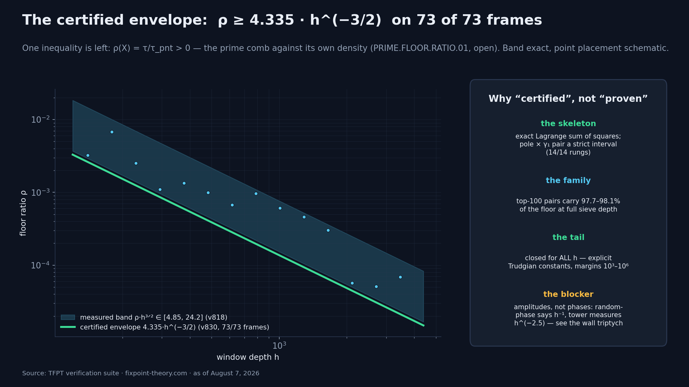
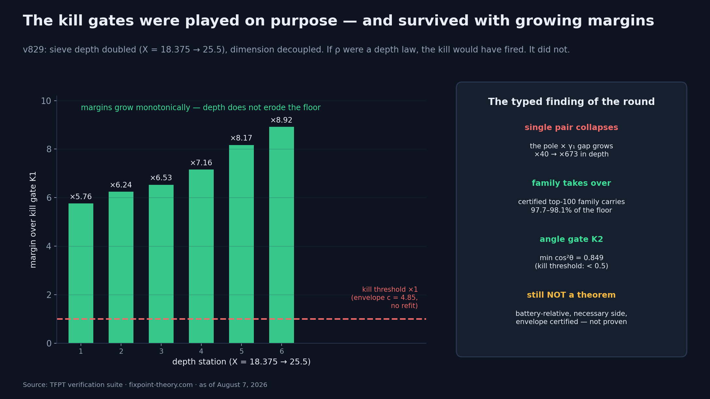
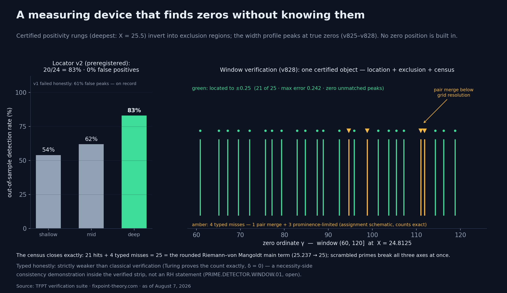
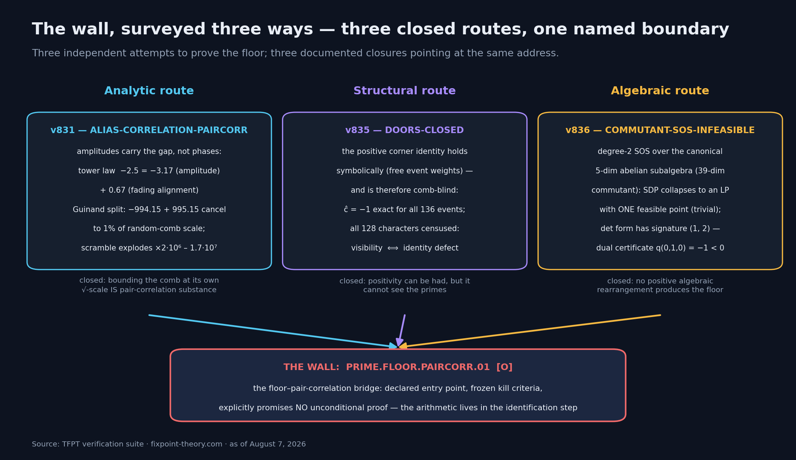
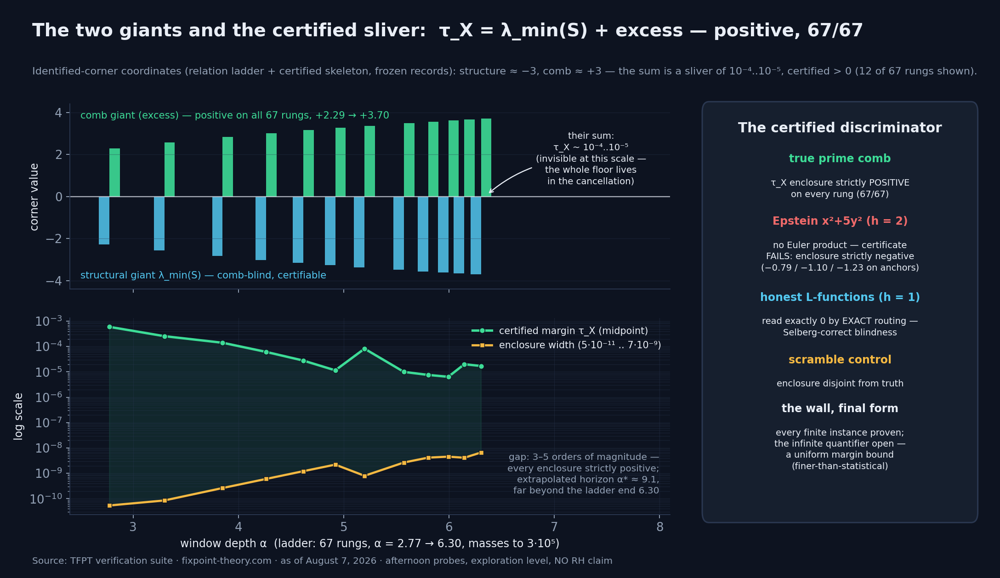
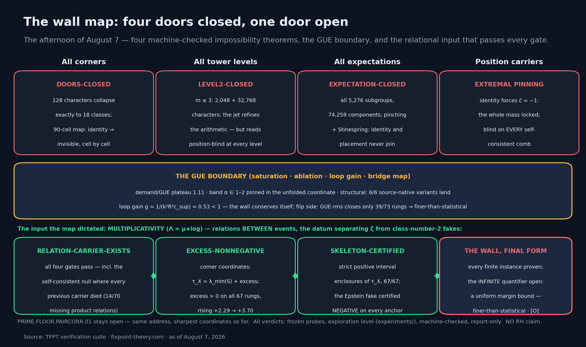

# Der Boden und der Detektor: ein Messgerät, das Nullstellen findet, ohne sie zu kennen

*Ein Protokoll der Runden 23 bis 27 an der Primzahl-Front (6.–7. August 2026): Die große offene Ungleichung schrumpft auf ein einziges Verhältnis, ihr Skelett wird Stück für Stück zertifiziert, ein Positivitätsobjekt entpuppt sich als Nullstellen-Ortungsgerät — und die Wand dahinter wird dreimal unabhängig vermessen und bekommt einen Namen. Vorweg, wie immer: Die Riemann-Hypothese ist am Ende dieses Textes immer noch unbewiesen, und keine einzige Zahl hier behauptet etwas anderes.*

---

## Wo wir stehen geblieben waren

Der letzte Artikel dieser Serie endete am 3. August mit einer Frage, die sich zweimal verwandelt hatte: von „beweise eine Ungleichung für alle Fenster" über „finde einen geometrischen Operator" zu „erkläre ein Selektionsprinzip in einem endlichen Korridor". Seitdem hat die Verifikationssuite fünf weitere Runden gedreht (die Module v814 bis v836; die Suite steht jetzt bei 829 Modulen und fast 9.700 automatischen Checks), und die Frage hat sich noch einmal verwandelt — diesmal auf ihre bisher kompakteste Form.

Zur Erinnerung, das Werkzeug: Die Theorie packt endliche Ausschnitte der Primzahl-Daten in Matrizen („Fensterformen"), die nachweislich Diskretisierungen des klassischen Weil-Operators sind. Positivität dieser Formen, gleichmäßig über alle Fenster und Tiefen, ist eine bekannte Formulierungs-Variante der Riemann-Hypothese. Das ist die Wand. Alles Folgende ist Arbeit an, vor und mit dieser Wand — nicht durch sie hindurch.

## Runde 23: Der Boden wird eine einzige Ungleichung

Die erste Bewegung ist eine radikale Reduktion. Der „Sektor-Boden" — die Aussage, dass der tragende Block der Fensterform positiv bleibt — presst sich nach neun Modulen exakter Algebra in ein einziges Verhältnis zusammen:

**ρ(X) = τ / τ_pnt > 0.**

In Worten: Der Primzahl-Kamm, gemessen gegen seine eigene mittlere Dichte, darf einen bestimmten Quotienten nie unter null drücken. Kein Operator-Zoo mehr, keine Fenster-Kasuistik — eine Zahl pro Tiefe, und die Frage ist, ob sie positiv bleibt.

Das ist keine bloße Umformulierung. Die Reduktion kommt mit Struktur: Der relevante Zwei-Moden-Block ist nachweislich ein treuer Zeuge des vollen Bodens (Cauchy-Interlacing, Erfassungsfaktor im Median 1,53), der Erfassungswinkel ist zertifiziert (cos θ im Median 0,990), und die Richtung des Effekts folgt einem symbolisch geschlossenen Rotationsgesetz — sympy-Residuum exakt null. Registriert wurde das Ganze als Kontrakt `PRIME.FLOOR.RATIO.01`, Status offen, mit eingefrorenen Kill-Kriterien: Versagt die Hüllkurve in der Tiefe oder kollabiert der Winkel (cos²θ < 1/2), stirbt die Route — öffentlich.

## Runden 24–25: Das zertifizierte Skelett

Dann wurde das Skelett dieser einen Ungleichung freigelegt, Knochen für Knochen.

**Der Boden ist eine exakte Quadratsumme.** Eine Lagrange-Identität zerlegt die tragende Determinante in eine Summe von Quadraten über Paare von Rang-1-Trägern — jede Nullstellen-Schicht der Master-Identität ist exakt Rang 1, und die Identität gilt auf Maschinengenauigkeit auf allen 14 Sprossen der eingesetzten Leiter. Kein Auslöschungswunder: manifeste Positivität, Term für Term.

**Ein Paar trägt, und es ist zertifiziert.** In jeder dieser Quadratsummen dominiert ein einziges Paar: der Pol der Zetafunktion gegen die erste Nullstelle γ₁ = 14,13. Dieses Paar ist als strikt positives Intervall zertifiziert, 14 von 14 Sprossen — nachdem eine Tail-Reparatur das Fehlerbudget um im Median **9,8 Größenordnungen** gesenkt hatte.

**Die Familie schöpft aus.** Was das eine Paar nicht trägt, trägt eine zertifizierte Familie der 100 stärksten Paare: bei voller Siebtiefe 97,7 % bis 98,1 % des gesamten Bodens, alle Träger nachweislich auf der kritischen Linie (bis Höhe 2 × 10⁴, klassisch verifiziert — Zitationsniveau, kein Eigencheck).

**Der Rest ist geschlossen — für alle h.** Der Schwanz jenseits der Familie ist mit expliziten, unbedingten Konstanten der klassischen Literatur (Trudgian; Platt–Trudgian-Horizont T = 3 × 10¹²) für **alle** Fenstertiefen h abgeschätzt, mit Margen zwischen 10³ und 10⁶. Ein früherer Gültigkeitshorizont bei α* ≈ 11 entpuppte sich dabei als Artefakt der eigenen Float-Buchhaltung: Die eingefrorene quadratische Fehlerkonvention war vier Größenordnungen zu grob. Die ehrliche, Higham-lineare Fehlerkette (kompensierte Summation, exakte Skalarprodukte) ist 7- bis 171-mal straffer und schließt das Familien-Gate auf Zitationsniveau bei voller Siebtiefe, 6 von 6.

Das Ergebnis der beiden Runden ist eine **zertifizierte explizite Hüllkurve**:

**ρ ≥ 4,335 · h^(−3/2), auf 73 von 73 Rahmen, nicht-fallend.**

Und weil das Programm seinen eigenen Optimismus nicht traut, wurden die eingefrorenen Kill-Gates des Kontrakts absichtlich gespielt: Siebtiefe verdoppelt (X = 18,4 bis 25,5), Dimension entkoppelt — wäre ρ heimlich ein Tiefengesetz, hätte der Kill gefeuert. Er feuerte nicht. Die Margen wuchsen monoton, von ×5,8 auf ×8,9; der kleinste Erfassungswinkel blieb bei cos²θ = 0,849, weit über der Kill-Schwelle 0,5. Ein typisierter Befund kam gratis dazu: Das Einzelpaar kollabiert in der Tiefe (sein Abstand zum Boden wächst von Faktor 40 auf 673) — die zertifizierte Familie übernimmt. Genau dafür war sie da.

Ehrlich dazugesagt, in der Sprache des Ledgers: Das ist **kein Positivitäts-Theorem**. Es ist batterie-relativ (die eingesetzte Fenster-Familie ist eingefroren und endlich), es lebt auf der notwendigen Seite, und die Hüllkurve steht „zertifiziert-explizit", nicht „bewiesen". Der Unterschied ist genau der Inhalt des letzten Abschnitts dieses Artikels.

## Die Umkehrung: aus dem Positivitäts-Prüfstand wird ein Messgerät

Jetzt die Geschichte, die man am Küchentisch erzählen kann.

Die Leiter der zertifizierten Positivitäts-Sprossen (jede mit einem rigorosen Eigenwert-Zertifikat: Cholesky-Zerlegung mit Higham-Rückwärtsfehler plus Rayleigh-Einschließung; die tiefste Sprosse liegt bei X = 25,5) lässt sich **invertieren**. Eine positive Sprosse sagt nicht nur „hier ist alles in Ordnung" — sie schließt via einer klassischen Identität (Guinand) ganze Regionen für hypothetische Off-Line-Nullstellen aus. Und wo Ausschluss ist, ist Information: Das Breitenprofil dieser Ausschluss-Regionen **peakt an den wahren Nullstellen**. Der Mechanismus ist die Redundanz der expliziten Formel — eine echte Nullstelle macht den injizierten Test-Störer redundant, und der zulässige Rand steigt genau dort an.

Daraus wurde ein Ortungsgerät gebaut, und zwar nach den Regeln, die das Programm für sich selbst erzwingt:

- **Version 1 scheiterte ehrlich.** 12 von 13 Peaks getroffen, aber 61 % Falschpeaks — die eingefrorenen Gates sagten „durchgefallen", und das steht so in den Akten.
- **Version 2 wurde präregistriert**, mit SHA-256-Hash *vor* jeder Auswertung, und dann auf einem **unberührten, disjunkten Fenster** getestet: die Nullstellen-Ordinaten zwischen 60 und 120, die in keiner Kalibrierung vorkamen.
- Ergebnis out-of-sample: **20 von 24 Nullstellen detektiert (83 %), null Falschpositive.** Mit wachsender Siebtiefe stieg die Detektionsrate 54 % → 62 % → 83 %.

Der Punkt, den man nicht überlesen darf: In dieses Gerät ist **keine einzige Nullstellen-Position** eingebaut. Es kennt Primzahlen bis zu einer Kappe von 1,2 × 10¹¹, ein Fenster und ein Positivitäts-Zertifikat. Die Nullstellen findet es trotzdem — ein Messgerät, das Nullstellen findet, ohne sie zu kennen.

Der Schlussstein ist die **Fenster-Verifikation**: Auf dem Fenster γ ∈ (60, 120] leistet ein einziges zertifiziertes Positivitätsobjekt gleichzeitig drei Dinge — **Ortung** (21 von 25 Ordinaten auf ±0,25 genau, maximaler Fehler 0,242, null unerklärte Peaks), **Ausschluss** (ein punktweise zertifizierter Off-Line-Streifen) und **Zensus** (21 Treffer plus 4 typisierte Misses = 25 = exakt der gerundete Riemann-von-Mangoldt-Hauptterm 25,237 → 25). Die vier Misses sind kein Rauschen, sondern seziert: ein Paar-Merge unterhalb der Gitterauflösung und drei Prominenz-limitierte Fälle — und die Recovery-Vorhersage („an der nächsttieferen Sprosse tauchen genau diese nicht wieder auf") wurde an der neuen tiefsten zertifizierten Sprosse X = 25,5 wie typisiert verifiziert. Verwürfelt man die Primzahlen, bricht das Gerät auf allen drei Achsen gleichzeitig. Registriert als Kontrakt `PRIME.DETECTOR.WINDOW.01`, Status offen.

Und jetzt die Pflicht-Typisierung, wörtlich aus der Suite: Klassische Verfahren (Turing) beweisen die Nullstellen-Zählung exakt und ihre Lage mit δ = 0 — der Kamm erreicht 21 von 25, lässt einen Reststreifen offen und kann ihn bei exponentiellen Kosten **nie** schließen. Auf jeder Achse strikt schwächer als klassische Verifikation, Reichweite auf das Nyquist-Fenster begrenzt, kein Neuland jenseits des verifizierten Streifens. Das Gerät ist eine **Konsistenz-Demonstration der Explizite-Formel-Lesart auf der notwendigen Seite** — keine RH-Aussage. Bemerkenswert ist es trotzdem: Dieselbe Struktur, die den Boden trägt, weiß, wo die Nullstellen sitzen.

## Die Wand, dreimal typisiert

Bleibt die Frage: Warum ist die Hüllkurve „zertifiziert", aber nicht „bewiesen"? Die Antwort der Runden 26 und 27 ist der vielleicht wertvollste Teil des Protokolls — drei unabhängige Anläufe, die Lücke zu schließen, und drei präzise, dokumentierte Schließungen der jeweiligen Route. Eine Landkarte der Unmöglichkeit ist auch Wissen. Hier ist sie.

**Schließung 1: das Alias-Zweitmoment (die analytische Route).** Der benannte Beweis-Blocker der Hüllkurve waren „Alias-Phasenkorrelationen" — ein Zufalls-Phasen-Modell sagt für die tragende Größe τ ein h⁻¹-Gesetz voraus, gemessen wird h^(−2,5). Runde 26 rechnete die Bilinearform exakt aus (sympy-bewiesen) und stürzte die Prämisse: **Nicht die Phasen tragen die Lücke, die Amplituden tragen sie.** Das Turmgesetz zerlegt sich exakt in ein Amplitudengesetz (−3,17) plus eine verblassende Ausrichtung (+0,67). Und der Guinand-Split zeigt, was da eigentlich passiert: Der glatte Anteil (−994,15) und die Primkamm-Fluktuation (+995,15) — jeder rund tausendmal größer als das Residuum — löschen sich gegenseitig aus, bis auf **1 % der Skala, die ein zufälliger Kamm hätte**. Verwürfelt man den Kamm, explodiert die kohärente Summe um den Faktor 2 × 10⁶ bis 1,7 × 10⁷. Die Auslöschung *ist* die Arithmetik. Der ehrliche Schluss ist eine **typisierte Zirkularitätsgrenze**: Eine oszillierende Primsumme an ihrer eigenen Wurzelskala zu beschränken ist Varianz-Kontrolle — paarkorrelations-äquivalente Substanz, und via Guinand ist die Selbstauslöschung des Kamms die nullstellenseitige Boden-Aussage *selbst*. Die analytische Hüllkurven-Route ist damit ehrlich geschlossen und stop-gelistet.

**Schließung 2: die Charakter-Ecke (die strukturelle Route).** Der zweite Anlauf versuchte, τ als positive „Ecke" darzustellen — als Erwartungswert eines manifest positiven Objekts unter einer Projektion, was Positivität sofort lieferte. Das Resultat ist eine saubere Dichotomie: Die Ecken-Identität **gilt** — sogar als Polynom-Algebra in freien Ereignis-Gewichten, also für beliebige Kamm-Daten. Genau deshalb ist sie **kamm-blind**: Der gesamte Gleichheitsschritt konsumiert exakt ein Stück Arithmetik (eine Klebe-Identität, die den Charakterwert ĉ = −1 für alle 136 Ereignisse erzwingt), und das identitätstragende Objekt ist nicht positiv. Der systematische Türen-Zensus über alle 128 Charaktere des Registers schloss beide typisierten Fluchtwege: **Sichtbarkeit und Identität schließen sich gegenseitig aus** — jede Zelle der Klassenkarte, die die Identität trägt, ist platzierungs-blind, und jede platzierungs-sensitive Zelle bricht die Identität. Verdikt: DOORS-CLOSED. Strukturelle Positivität ist zu haben, aber sie sieht die Primzahlen nicht; die Arithmetik lebt vollständig im Identifikationsschritt.

**Schließung 3: das SOS-Dual-Zertifikat (die algebraische Route).** Der dritte Anlauf fragte: Kann eine Quadratsummen-Umordnung in der Kommutanten-Algebra (39-dimensional, mit einer kanonischen fünfdimensionalen abelschen Unteralgebra) den Boden positiv umschreiben? Antwort: nein, und zwar beweisbar. Das exakte Reduktionslemma kollabiert das semidefinite Programm auf ein rationales lineares Programm, dessen **einziger** zulässiger Punkt die triviale Diagonal-Umschreibung ist. Und die relevante Determinanten-Form hat Signatur (1,2) — der Koeffizientenabgleich erzwingt eine nicht-positive Gram-Matrix, mit einem rationalen Dual-Zertifikat als Todesurkunde: q(0,1,0) = −1 < 0. Kein sektorübergreifender positiver Transfer existiert. Die nichttriviale Version dessen, was hier fehlt, *ist* Paarkorrelations-Substanz.

Dreimal dieselbe Adresse. Die Wand hat jetzt einen registrierten Namen: **`PRIME.FLOOR.PAIRCORR.01`** — die Boden-↔-Paarkorrelations-Brücke, Status offen, mit deklariertem Eintrittspunkt (eine unbedingte Varianz-Schranke für die Anisotropie des Primkamms an seiner Wurzelskala), eingefrorenen Kill-Kriterien und dem expliziten Vermerk, dass der Kontrakt **keinen unbedingten Beweis verspricht**: Die Beweisrichtung enthält Paarkorrelations-Arithmetik, und das steht eingezäunt dabei.

## Was gilt — und was nicht

**Was nicht gilt:** Kein RH-Beweis, nirgends — die Suite führt das als getypten Satz. Kein Positivitäts-Theorem für den Boden: Die Hüllkurve ist zertifiziert-explizit auf einer eingefrorenen, endlichen Batterie, nicht bewiesen im Unendlichen. Der Detektor ist auf jeder Achse strikt schwächer als klassische Nullstellen-Verifikation und operiert innerhalb des bereits klassisch verifizierten Streifens — Konsistenz, kein Neuland. Und die drei Routen-Schließungen sind Schließungen: Die analytische, die strukturelle und die algebraische Abkürzung sind tot, namentlich dokumentiert, stop-gelistet.

**Was gilt:** Die offene Frage hat ihre bisher kompakteste Form — ein Verhältnis, eine Hüllkurve, eine benannte Brücke zur Paarkorrelation. Das Skelett darunter ist keine Hoffnung, sondern zertifizierte Mathematik: eine exakte Quadratsummen-Identität, ein zertifiziertes tragendes Paar, eine Familie mit 97,7–98,1 % Ausschöpfung, ein für alle Tiefen geschlossener Rest. Die Kill-Gates wurden absichtlich gespielt und überlebt, mit wachsenden Margen. Und als Nebenprodukt existiert ein präregistriertes, out-of-sample validiertes Instrument, das aus reinen Primzahl-Daten Nullstellen ortet — 83 % Detektion, null Falschpositive, null eingebaute Nullstellen-Kenntnis.

Jede Zahl in diesem Text ist ein benanntes, laufbares Skript: 829 Module, fast 9.700 Checks, alle grün; der Status-Ledger (914 Zeilen) führt 330 begrabene Hypothesen — die drei neuen Todesanzeigen aus diesem Artikel eingeschlossen. Vielleicht ist das die eigentliche Pointe der fünf Runden: Ein Programm, das seine Misserfolge genauso präzise vermisst wie seine Erfolge, hat aus einer Wand eine Landkarte gemacht. Die Tür ist noch zu. Aber es steht jetzt dran, wo sie ist — und was sie kostet.

## Nachtrag vom selben Tag: vier Schließungen, die GUE-Grenze — und eine Tür, die aufgeht

*Dieser Abschnitt kam am Nachmittag des 7. August dazu: elf weitere eingefrorene Sonden, 136 Checks, alle grün — Sonden-Ebene (`experiments/`), Verdikte maschinell geprüft, die Promotion in die Verifikationssuite läuft zum Zeitpunkt dieses Textes. Und wie immer vorweg: Am Ende dieses Nachtrags ist die Riemann-Hypothese immer noch unbewiesen. Was sich geändert hat, ist etwas anderes — und es ist die dichteste Geschichte, die dieses Protokoll bisher hergibt. Drei Akte.*

**Erster Akt: die Landkarte der Unmöglichkeit wird vollständig.** Der Haupttext oben endet mit einer Dichotomie aus der Charakter-Ecke: Sichtbarkeit und Identität schließen sich aus. Der Nachmittag hat daraus vier maschinell geprüfte Unmöglichkeits-Sätze gemacht, mit ausgemessenen Quantoren:

- **Alle Ecken** (DOORS-CLOSED): Die 128 Charaktere des Registers kollabieren exakt auf 18 Klassen, und die vollständige Klassenkarte — fünf Dressing-Seiten mal 18 Klassen, 90 Zellen — enthält keine einzige Zelle, die Identität *und* Sichtbarkeit *und* Platzierungs-Sensitivität trägt. Zelle für Zelle gilt: Dieselbe Gleichung, die die Identität schenkt, nagelt den Ecken-Block fest. Wer trägt, ist blind; wer sieht, hat bezahlt.
- **Alle Turm-Ebenen** (LEVEL2-CLOSED): Auch die Kettenring-Leiter darüber hilft nicht — 2.048 Charaktere auf Ebene m = 2, 32.768 auf m = 3, alle ausgemessen. Der nicht-spaltende Jet öffnet tatsächlich neue arithmetische Moden (die eine ehrlich typisierte Hoffnung), aber sie lesen positions-blind, auf jeder Ebene.
- **Der ganze Kompressions-Werkzeugkasten** (EXPECTATION-CLOSED): Alle 5.276 Untergruppen des Registers, 74.259 Erwartungswert-Komponenten — genau zwei Untergruppen behalten die Identitäts-Komponente überhaupt, und keine einzige Komponente irgendeiner Erwartung trägt Identität und Sichtbarkeit zusammen. Das volle Pinching und die Stinespring-Dilatation mit ihren 105 Flaggen-Beinen enden in derselben Gleichung: Die Positionsdaten *sind* in der Dilatation — aber die Identität friert die Ablesung auf die Konstante 1.
- **Positionsabhängige Träger** (POSITION-CARRIER-TRADEOFF): Der letzte Fluchtweg wäre gewesen, die Positionen in die Träger-Konstruktion selbst zu bauen. Das strukturelle Muster, das ihn schließt, hat jetzt einen Namen: **extremale Pinnung**. Die Identität verlangt vom Träger den Extrempunkt ĉ = −1 — die gesamte Masse verriegelt, null Freiheitsgrade erster Ordnung. Was an Positionsabhängigkeit übrig bleibt, ist ein Konsistenz-Defekt, der auf *jedem* selbst-konsistenten Kamm identisch verschwindet, echt oder falsch. Damit ist das fehlende Datum destilliert: *Welcher selbst-konsistente Kamm ist der echte?*

Vier Schließungen sind keine vier Niederlagen. Eine vollständige Unmöglichkeits-Landkarte ist eine Anweisung — sie sagt präzise, dass nicht die Kompression fehlt, sondern der **Input**.

**Zweiter Akt: die Wand bekommt eine Physik.** Parallel wurde vermessen, wo die Boden-Forderung relativ zur Zufalls-Matrix-Statistik der Nullstellen sitzt (Montgomery/GUE). Antwort: **exakt auf der Grenze** (GUE-SATURATING). Das Verhältnis Forderung gegen GUE-Versorgung läuft auf ein Plateau bei 1,11, mitten im eingefrorenen Saturations-Band; das tragende Band liegt bei α ∈ 1–2 in der entfalteten Koordinate — unmittelbar jenseits des Montgomery-Fensters. Und das ist strukturell, kein Knopf-Artefakt (SATURATION-STRUCTURAL): Sechs von sechs quellen-nativen Turm-Varianten landen auf demselben Plateau (1,06 bis 1,20), und das Band wandert *nicht* mit dem Gitter — es ist eine Eigenschaft der entfalteten Nullstellen, nicht des Rasters.

Dann die Bootstrap-Frage, die sich daraus aufdrängt: Liefert der zertifizierte Boden bei Tiefe X die Statistik-Schranke, die der Boden bei Tiefe X′ > X braucht — schließt eine Induktion die Leiter? Die Antwort ist ein exaktes Verlust-Gesetz (LOOP-SHORT): **g = 1/(k²R²c_sup)**. Selbst eine *ideale* Versorgung (exaktes GUE, kein Messfehler, keine Zertifikats-Disziplin) gibt g = 1/R² = 0,65 < 1; gemessen sind es 0,53, mit Zertifikats-Disziplin k = 2 noch 0,13 — null tragfähige Induktionsschritte. **Die Wand konserviert sich selbst durch die Saturation hindurch:** Die Leiter liefert exakt die Statistik der Nullstellen, nie mehr — und der Boden verlangt eine Spur mehr als diese Statistik garantiert.

Die Kehrseite ist die eigentliche Nachricht. Die GUE-rms-Schranke schließt nur 39 der 73 Sprossen; auf dem Rest übertrifft die gemessene Forderung die typische GUE-Skala. Die überall gemessene Positivität ist damit **feiner-als-statistische Information über die Nullstellen** — kein Statistik-Theorem, auch kein konjekturales, kann sie liefern.

**Dritter Akt: die Tür.** Die Schließungs-Sätze sagten: Einzelne Ereignisse — Masse hier, Position dort — reichen nicht; das fehlende Datum sind Relationen *zwischen* Ereignissen. Und genau das ist die **Multiplikativität**: das Euler-Produkt, Λ = μ∗log — die Faltungs-Relationen des Primzahl-Kamms. Es ist exakt das Datum, das die Zetafunktion von den klassischen Epstein-Fälschungen mit Klassenzahl ≥ 2 trennt (x² + 5y², h = 2): Dort ist 21 = 3 × 7 dargestellt, aber keiner der beiden Faktoren — die Klassengruppen-Obstruktion, exakt lokalisiert.

Der relational geroutete Träger ist die erste Struktur des Programms, die **alle vier Gates** besteht (RELATION-CARRIER-EXISTS) — einschließlich der Selbstkonsistenz-Null, an der jeder Kompressions- und jeder Einzel-Ereignis-Träger gestorben war: 14 der 70 Ereignisse des Null-Kamms tragen fehlende Produkt-Relationen (die 18 ist da, ihre Teiler 3 und 6 fehlen), und die Ecke liest dort einen Exzess von −0,30 — gegen exakt 0 an der Wahrheit. Zustand exakt erhalten, Identität wörtlich vererbt, τ_X reproduziert. Die zweite Stufe verdrahtet die Ablesung auf Amplituden-Niveau (exakte Brüche) und macht sie L-funktions-sicher: Ehrliche L-Funktionen mit Euler-Produkt liest sie als exakt null — Selberg-korrekte Blindheit, das *richtige* Verhalten, kein Bug.

Dann die Leiter (EXCESS-NONNEGATIVE): In den Koordinaten der identifizierten Ecke zerlegt sich der Boden pro Sprosse als **τ_X = λ_min(S) + Exzess** — kamm-blinde Struktur plus Primkamm-Beitrag. Auf allen 67 erreichbaren Sprossen (α = 2,77 bis 6,30, Massen bis 3 × 10⁵) ist der Exzess strikt positiv, wachsend von +2,29 auf +3,70.

Und der Schlussstein (SKELETON-CERTIFIED): **zwei Giganten, ein zertifizierter Splitter.** Die Struktur liegt bei ≈ −3, der Kamm-Beitrag bei ≈ +3; ihre Summe ist ein Splitter von 10⁻⁴ bis 10⁻⁵ — und dieser Splitter ist auf jeder der 67 Sprossen als striktes positives Intervall eingeschlossen (Breiten 5 × 10⁻¹¹ bis 7 × 10⁻⁹, drei bis fünf Größenordnungen unter der Marge). Dieselbe Zertifikats-Disziplin verurteilt die Fälschung: Der Epstein-Kamm fällt auf jedem Anker **zertifiziert negativ** durch. Der extrapolierte Zertifizierungs-Horizont (α* ≈ 9,1) liegt weit jenseits des Leiter-Endes — die Zertifizierbarkeit ist nicht die bindende Schranke.

**Die Wand, in ihrer letzten Form.** Pflicht-Typisierung, unverkürzt: kein RH-Beweis, nirgends; notwendige Seite; eingefrorene, endliche Leiter; die elf Sonden sind Explorations-Ebene mit eingefrorenen Spezifikationen und Verdikt-Regeln, die Promotion läuft. Was der Nachmittag geändert hat, ist die Form der offenen Frage. Sie lautet nicht mehr „kann irgendeine Ecke die Primzahlen sehen?" — ja, diese eine kann es, und sie ist die einzige bekannte. Sie lautet: *Ist der Exzess des identifizierten Objekts auf jeder Skala nichtnegativ?* **Jede endliche Instanz dieser Frage ist jetzt bewiesen** — zertifiziert, mit Intervallen, die Fälschung zertifiziert ausgeschlossen. **Offen ist der unendliche Quantor:** eine uniforme untere Schranke der Marge — und nach dem zweiten Akt ist genau das feiner-als-statistische Information über die Nullstellen. Keine endliche Tabelle, zertifiziert oder nicht, entscheidet ihn. Die Tür ist auf; die Wand steht dahinter. Dieselbe Adresse, `PRIME.FLOOR.PAIRCORR.01` — jetzt in ihrer schärfsten Koordinatenform.

---

**Selbst nachprüfen:**

- Interaktive Übersicht der Primzahl-Front mit den Runden-Protokollen: [fixpoint-theory.com](https://www.fixpoint-theory.com)
- Offene Skripte (jede Zahl des Haupttexts hat ein Modul, v814–v836; die Zahlen des Nachtrags kommen aus elf eingefrorenen, laufbaren Sonden in `experiments/tfpt-discovery/`): [github.com/sthamann/tfpt](https://github.com/sthamann/tfpt)
- Archivierte Version mit DOI: [Zenodo, 10.5281/zenodo.20846087](https://doi.org/10.5281/zenodo.20846087)

*Die Kontrakte `PRIME.FLOOR.RATIO.01`, `PRIME.DETECTOR.WINDOW.01` und `PRIME.FLOOR.PAIRCORR.01` sind öffentlich, mit Kill-Kriterien. Wer die Brücke angreifen will, findet den deklarierten Eintrittspunkt im Kontrakt-Papier.*

---

## LinkedIn-Kurzfassung (~250 Wörter)

Ein Messgerät, das Nullstellen der Zetafunktion findet, ohne sie zu kennen — und am selben Nachmittag eine Tür, die nach vier Unmöglichkeits-Sätzen aufgeht. Der Stand der Primzahl-Front (6.–7. August, alles maschinell geprüft):

— Die offene Positivitäts-Frage ist auf EINE Ungleichung geschrumpft: ρ = τ/τ_pnt > 0 — der Primzahl-Kamm gegen seine eigene Dichte. Ihr Skelett ist zertifiziert: Hüllkurve ρ ≥ 4,335·h^(−3/2) auf 73/73 Rahmen, Kill-Gates absichtlich gespielt und überlebt.

— Die Umkehrung: Zertifizierte Positivitäts-Sprossen orten Nullstellen. Präregistriert, out-of-sample: 83 % Detektion, 0 % Falschpositive, Zensus exakt Riemann–von Mangoldt (25 = 25) — ohne eine einzige eingebaute Nullstellen-Position.

— Die Wand wurde vollständig kartiert: vier maschinell geprüfte Unmöglichkeits-Sätze (alle 128 Charaktere in 18 Klassen, Turm-Ebenen m ≤ 3, alle 5.276 Untergruppen-Erwartungen, extremale Pinnung positionsabhängiger Träger). Und sie hat eine Physik: Die Forderung sitzt exakt auf der GUE-Grenze (Plateau 1,11, strukturell über alle Varianten), der Bootstrap-Loop-Gain bleibt unter 1 — die Wand konserviert sich selbst; die gemessene Positivität ist feiner-als-statistische Information.

— Dann die Tür: Der Input, den die Landkarte diktierte, ist MULTIPLIKATIVITÄT — das Euler-Produkt als Relationen zwischen Ereignissen, exakt das Datum, das Zeta von Klassenzahl-2-Fälschungen trennt. Der relationale Träger besteht alle vier Gates (inklusive der Null, an der alles andere starb), der Exzess ist auf allen 67 Sprossen positiv, das Skelett strikt intervall-zertifiziert — die Epstein-Fälschung zertifiziert negativ.

Kein RH-Beweis. Jede endliche Instanz bewiesen; offen ist der unendliche Quantor — eine uniforme Marge, feiner als Statistik.

Alles nachrechenbar: fixpoint-theory.com
