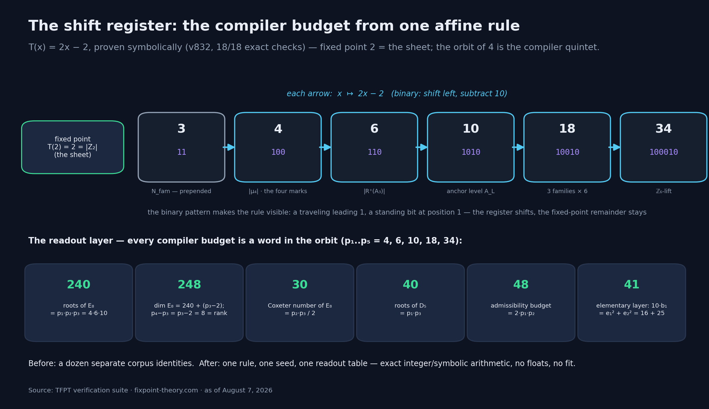
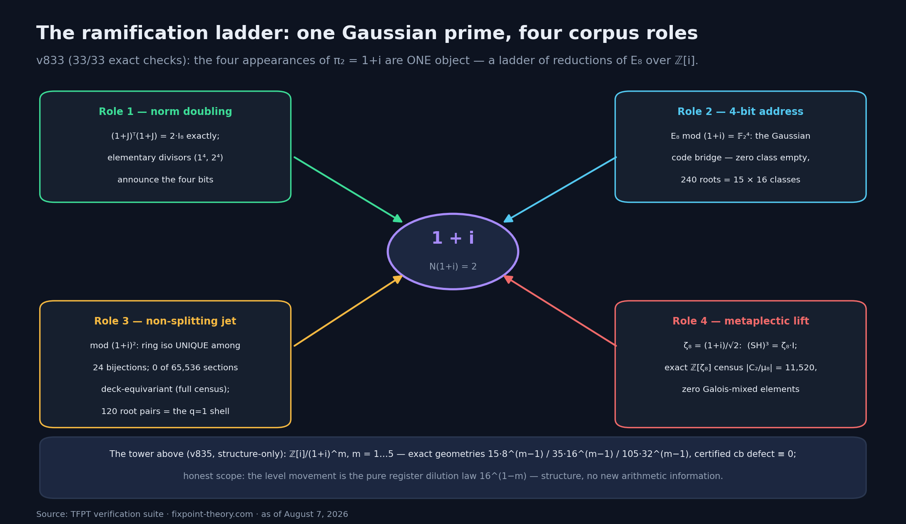

# Ein Register, ein Takt: Der Kern der Theorie komprimiert auf eine Regel

*Runde 27 an einer ganz anderen Front (7. August 2026): Vier exakte Kompressionen zeigen, dass der dimensionslose Kern der TFPT — die Zahlen, aus denen der Compiler das Standardmodell liest — auf eine einzige affine Regel plus eine Ablese-Schicht zusammenschrumpft. Ein Schieberegister, eine Prüfsummen-Matrix, eine Gauß-Primzahl in vier Rollen, eine endliche Geometrie. Und am Ende, wie immer: die ehrliche Grenze, inklusive der Frage, die diese Kompression unweigerlich provoziert — und warum sie nicht das bedeutet, was sie zu bedeuten scheint.*

---

## Worum es geht

Die Hintergrund-Artikel dieser Serie erzählen, wie TFPT aus zwei Axiomen über das E₈-Gitter das Standardmodell „kompiliert". In den Papieren stand der dimensionslose Kern dieser Kompilation bisher als Sammlung von Einzelidentitäten: 240 Wurzeln hier, 248 Dimensionen dort, eine Flavor-Matrix mit bestimmten Einträgen, ein Vier-Bit-Code, eine 105-teilige Prüfstruktur. Alles maschinell verifiziert — aber als *Liste*.

Runde 27 (fünf neue Module, v832–v836, aus sieben eingefrorenen Sonden) hat diese Liste normalisiert. Das Ergebnis ist eine Kompression im wörtlichen, informationstheoretischen Sinn: Dieselben Daten, drastisch kürzer beschrieben — als eine Rekursion plus Ablesungen. Kompression ist ein starkes Indiz für Struktur (Zufallsdaten lassen sich nicht komprimieren), und sie macht die Theorie *angreifbarer*: je kürzer die Beschreibung, desto weniger Stellen, an denen man sich herausreden kann. Genau deshalb lohnt sich diese Geschichte. Was Kompression **nicht** ist, steht am Ende.

## Das Schieberegister

Der Anker der Theorie ist ein unscheinbares Zahlentripel: a = (1, 1, 2). Seine Potenzsummen — erste Potenzen, Quadrate, Kuben und so weiter — sind p_n = 1 + 1 + 2ⁿ = 2 + 2ⁿ. Und diese Folge gehorcht, symbolisch bewiesen (sympy, identisch in n), einer einzigen affinen Regel:

**p_{n+1} = 2·p_n − 2, kurz: T(x) = 2x − 2.**

Wer Binärzahlen liest, erkennt die Maschine sofort: „mal 2" ist ein Links-Shift, „minus 2" zieht das Bit an Position 1 ab. Zieht man die 2 gleich ganz ab (q_n = p_n − 2 = 2ⁿ), bleibt reines Verdoppeln — ein Schieberegister. Der Fixpunkt der Regel ist T(2) = 2: die Zahl des Doppelblatts der Trägergeometrie, der Punkt, an dem das Register stillsteht.

Jetzt das Bemerkenswerte. Startet man das Register bei 4 und lässt es laufen, entsteht:

| n | p_n | binär | Compiler-Bedeutung |
|---|-----|-------|--------------------|
| 1 | 4 | `100` | die vier Marken (\|μ₄\|) |
| 2 | 6 | `110` | die positiven A₃-Wurzeln |
| 3 | 10 | `1010` | der Anker-Level A_L |
| 4 | 18 | `10010` | 3 Familien × 6 (N_fam·\|R⁺(A₃)\|) |
| 5 | 34 | `100010` | der ℤ₆-Lift |

Vorangestellt: p₀ = 3 = die Zahl der Familien, mit T(3) = 4 als Einstieg. Das binäre Muster ist die Regel, sichtbar gemacht: eine wandernde führende Eins, ein stehendes Bit an Position 1 — das Register schiebt, der Fixpunkt-Rest bleibt.

Und das gesamte Budget des Compilers besteht aus Worten in diesem Orbit: Die 240 Wurzeln von E₈ sind p₁·p₂·p₃ = 4·6·10. Die Dimension 248 ist 240 + (p₃ − 2), und die Leiter-Identität p₄ − p₃ = p₃ − 2 = 8 macht daraus dieselbe Formel wie die Korpus-Schreibweise — die 8 ist zugleich Coxeter-Zahl von D₅ und Rang von E₈. Die Coxeter-Zahl 30 von E₈ ist p₂·p₃/2. Die 40 Wurzeln von D₅ sind p₁·p₃. Das Zulässigkeits-Budget 48 ist 2·p₁·p₂. Sogar die krumme 41 der Elementarschicht ist e₁² + e₂² = 16 + 25 mit (e₁, e₂, e₃) = (4, 5, 2) — Marken, Trägerrang, Blatt. Achtzehn Checks, alle exakt, keine Floats, kein Fit (v832 Teil A).

Vorher: ein Dutzend Einzelidentitäten. Nachher: **eine Regel, ein Startwert, eine Ablese-Tabelle.**

## Die Prüfsummen-Matrix

Die zweite Kompression betrifft die Flavor-Struktur — die Matrix R = [[1,3,0],[1,5,2],[2,5,3]], deren Zeilen in der Theorie die Quark-Sektoren adressieren. Die neue Beobachtung (v832 Teil B): Diese Matrix ist eine **bidirektionale Prüfsumme**. Multipliziert man sie mit dem Anker, kommt auf *beiden* Seiten Register-Vokabular heraus:

- **R·a = (4, 10, 13)** — das ist (p₁, p₃, N(3+2i)): zwei Orbit-Worte und die Norm einer Gauß-Primzahl.
- **Rᵀ·a = (6, 18, 8)** — das ist (p₂, p₄, p₃−2): zwei weitere Orbit-Worte und die Leiter-Konstante.

Derselbe Anker dekodiert Zeilen- und Spaltenseite. Dazu die Fingerabdrücke: Spur 9 = p₀², Determinante 8 = p₃ − 2, und das charakteristische Polynom hat als Koeffizienten ausschließlich Register-Worte.

Das könnte Numerologie sein — wäre da nicht der Ablationstest. Von zwölf Kandidaten für die mittlere Zeile (alle Anordnungen der akzeptierten Einträge {1,5,2} und des nächstliegenden „Geschwister"-Tripels {1,3,4}) besteht **genau einer** den vollen Identitätssatz: der akzeptierte. Und der Test ist auf eine einzige Zahl komprimierbar: Die Anker-Kontraktion der mittleren Zeile muss 10 = p₃ ergeben — die Geschwister liefern 11 und 12. Eine Prüfsumme mit Ein-Zahl-Kill, 15 von 15 Checks, selektiv (v832 Teil B).

## Eine Gauß-Primzahl, vier Rollen

Die dritte Kompression löst eine Redundanz im Korpus auf. An vier verschiedenen Stellen der Theorie taucht dieselbe Zahl auf: **1 + i**, die Gauß-Primzahl über der 2. Bisher waren das vier unabhängige Auftritte. Modul v833 (33 Checks, exakt) zeigt: Es ist **ein Objekt in vier Rollen** — eine Verzweigungsleiter:

1. **Norm-Verdopplung:** Die Multiplikation mit (1+i) verdoppelt Normen exakt — (1+J)ᵀ(1+J) = 2·I₈ als Matrix-Identität, mit den Elementarteilern (1⁴, 2⁴), die die Vier-Bit-Struktur bereits ankündigen.
2. **Vier-Bit-Adresse:** Die Reduktion von E₈ an (1+i) liefert die 16 Klassen der Gauß-Codebrücke (der Star des Big-Picture-Artikels): Nullklasse beweisbar leer, 240 = 15 × 16.
3. **Nicht-spaltender Jet:** Eine Ebene tiefer (modulo (1+i)²) wird es starr: Der Ring-Isomorphismus ist eindeutig unter allen 24 Kandidaten-Bijektionen, und von 65.536 möglichen Schnitten ist **exakt null** deck-äquivariant — die Erweiterung spaltet nicht, beweisbar durch Voll-Zensus. Die 120 Wurzelpaare sind genau die q=1-Schale dieses Jets.
4. **Metaplektischer Lift:** Die achte Einheitswurzel ζ₈ = (1+i)/√2 steuert die Phasen der Clifford-Ebene: (SH)³ = ζ₈·I, und ein exakter Zensus über ℤ[ζ₈] zählt \|C₂/μ₈\| = 11.520 mit null Galois-gemischten Elementen.

Vier Kapitel des Korpus, eine Primzahl. Dazu passt der Turm darüber (v835 Teil B): Die Kettenring-Leiter ℤ[i]/(1+i)^m trägt für m = 1…5 exakte endliche Geometrien mit den Zählungen 15·8^(m−1), 35·16^(m−1), 105·32^(m−1) und strikt projektive Kanäle mit zertifiziertem cb-Defekt **identisch null**. Die Leiter ist real und exakt — was sie *nicht* leistet, steht in der Grenz-Sektion.

## Die Flaggen-Geometrie: 105 + 35 = 140

Die vierte Kompression ist die geometrischste. Der Fehlerkorrektur-Code der Theorie hat 105 Gewicht-4-Prüfworte plus 35 „Ursprungs-Ebenen" — zusammen 140, exakt der Zensus des Reed-Muller-Codes RM(2,4). Runde 27 gibt diesen Zahlen ihre geometrische Normalform (v834, 26 Checks): Die 105 sind die **Flaggen der projektiven Geometrie PG(3,2)**, und die Zerlegung 105 = 45 + 60 ist auf beiden Seiten dieselbe Bahnen-Zerlegung unter der symplektischen Gruppe Sp(4,2).

Auf den 60 nicht-isotropen Sprossen existiert ein **Polaritäts-Wörterbuch**: bijektiv, äquivariant unter allen 720 Gruppenelementen, inzidenz-erhaltend — eine ehrliche Übersetzung zwischen Code und Geometrie. Auf den 45 „Doily"-Sprossen dagegen steht eine **typisierte Obstruktion**: Der Übersetzungskandidat schneidet leer (45 von 45), und die Gram-Matrizen widersprechen sich (18I + 3J gegen 22I + 6J). Die Merkregel „105 Checks = 105 Flaggen" ist also eine deck-äquivariante *Bijektion*, aber kein Inzidenz-*Isomorphismus*.

Warum das erzählenswert ist: Diese Obstruktion ist kein Schönheitsfehler, sondern eine **Erklärung**. Eine Woche zuvor war eine Konstruktion (die „Vakuum-Dilatation", v822) an einer Positivitätsschranke gestorben — gemessen, aber unverstanden. Die Flaggen-Normalform liefert den typisierten Grund nach: Die Identifikation, die jene Konstruktion gebraucht hätte, existiert auf 45 der 105 Sprossen beweisbar nicht. Der Tod von letzter Woche hat jetzt einen Obduktionsbericht.

## Die ehrliche Grenze — und die Simulationsfrage

Zeit für die Sektion, die in dieser Serie nie fehlt.

**Was die Kompression nicht leistet.** Erstens: Sie betrifft den *dimensionslosen* Kern. Die eine Maßeinheit der Theorie — warum die Welt eine absolute Skala hat (`v_geo`) — bleibt das offene Tor Nummer eins; kein Schieberegister erzeugt ein Meter. Zweitens: Kontinuum und Positivität sind offen. Die Verbindung der diskreten Register-Schicht zur Kontinuums-Analysis ist genau die Wand, die der Schwester-Artikel dieser Ausgabe vermisst — Runde 27 selbst hat zwei Kandidaten-Routen dorthin geschlossen (die Ecken-Route: strukturell vollständig, aber beweisbar kamm-blind; die SOS-Route: per rationalem Dual-Zertifikat unzulässig). Der Hjelmslev-Turm von oben trägt exakte Strukturen, aber seine Ebenen-Bewegung ist das reine Verdünnungsgesetz 16^(1−m) — Struktur, keine neue Information. Drittens, und am wichtigsten: **Der Compiler ist Struktur, kein laufendes Programm.** Es gibt keine Zeitentwicklung, keinen Prozessor, der die Rekursion „ausführt" — es gibt eine statische Konsistenzstruktur, deren kürzeste Beschreibung eine Rekursion plus Ablesungen ist.

Damit zur Frage, die eine solche Kompression unweigerlich provoziert: *Wenn der Kern der Physik auf eine Regel plus Ablese-Schicht passt — leben wir dann in einer Simulation?* Die nüchterne Antwort: Das folgt nicht, und zwar aus einem präzisen Grund. Kompressibilität ist eine Aussage über die **Beschreibung** einer Struktur, nicht über ihre **Ausführung**. Dass sich die Kreiszahl π aus einer kurzen Formel entwickeln lässt, macht Kreise nicht zu Programmen, die irgendwo laufen; dass die E₈-Budgets Worte in einem T-Orbit sind, macht das Universum nicht zu einem Prozess auf fremder Hardware. Eine Simulations-These bräuchte genau das, was hier ausdrücklich fehlt und als offen geführt wird: eine Dynamik der Ausführung, eine Skala, ein Substrat. Was die Kompression stattdessen zeigt, ist bescheidener und prüfbarer: Der Kern ist **nicht zufällig** — er hat eine kurze Beschreibung, und kurze Beschreibungen kann man falsifizieren. Der Ein-Zahl-Kill der Prüfsummen-Matrix ist dafür das beste Beispiel: Eine 11 oder 12 statt der 10, und die Kompression wäre tot.

**Was bleibt:** Fünf Module, 141 Checks, alle exakt (ganzzahlige und symbolische Arithmetik, keine Floats, kein Fit, keine Zufallszahlen in den tragenden Beinen), promoviert ohne Herunterskalierung, mit Negativkontrollen — falsche Regel, falscher Anker, Geschwister-Matrix — die alle wie erwartet brechen. Die Suite steht bei 829 Modulen, der Ledger bei 914 Zeilen, und kein einziger Status-Marker wurde bewegt: Die Kompression ist eine Normalform, kein neuer Anspruch.

*Nachtrag (7. August, nachmittags):* Die beiden oben zitierten Routen-Schließungen sind seit dem Nachmittag Teil einer vollständigen Landkarte — vier maschinell geprüfte Unmöglichkeits-Sätze (alle 128 Charaktere, Turm-Ebenen m ≤ 3, alle 5.276 Untergruppen-Erwartungen, positionsabhängige Träger mit extremaler Pinnung). Und die Antwort, die eine solche Landkarte diktiert — ein Input-Wechsel zu Multiplikativität, dem Euler-Produkt als Relationen zwischen Ereignissen — hat die Ecken-Route mit einem relationalen Träger wieder geöffnet: Exzess positiv auf allen 67 Sprossen, Skelett strikt intervall-zertifiziert, die Epstein-Fälschung zertifiziert negativ. Die ganze Drei-Akt-Geschichte, inklusive der GUE-Grenze und der ehrlichen Wand-Aussage, steht im neuen Schlussabschnitt des Schwester-Artikels dieser Ausgabe.

Ein Register, ein Takt, eine Ablese-Schicht — und dahinter, unverändert und ehrlich beschildert: die offenen Tore.

---

**Selbst nachprüfen:**

- Website mit interaktiven Erklärungen und Status-Übersicht: [fixpoint-theory.com](https://www.fixpoint-theory.com)
- Offene Skripte (v832–v836 für diesen Artikel): [github.com/sthamann/tfpt](https://github.com/sthamann/tfpt)
- Archivierte, zitierfähige Version: [Zenodo, DOI 10.5281/zenodo.20846087](https://doi.org/10.5281/zenodo.20846087)

*Die Hintergrund-Geschichte — zwei Axiome, E₈, der Vier-Bit-Code — steht im Big-Picture-Artikel dieser Serie; die Primzahl-Front im Schwester-Artikel dieser Ausgabe.*

---

## LinkedIn-Kurzfassung (~200 Wörter)

Der dimensionslose Kern einer Theorie, die das Standardmodell aus zwei Axiomen kompiliert, ist auf eine einzige Regel geschrumpft: T(x) = 2x − 2. Ein Schieberegister.

Der Orbit von 4 unter dieser Regel — 4, 6, 10, 18, 34, binär 100, 110, 1010, 10010, 100010 — liefert exakt die Compiler-Konstanten: 240 E₈-Wurzeln (4·6·10), Dimension 248, Coxeter-Zahl 30, alle Budgets. Fixpunkt der Regel: 2, das Doppelblatt. Symbolisch bewiesen, 18/18 Checks.

Dazu drei weitere exakte Kompressionen (7. August, v832–v836):

— Die Flavor-Matrix ist eine bidirektionale Prüfsumme: R·a und Rᵀ·a liefern beide Register-Vokabular; von 12 Kandidaten-Zeilen besteht genau 1 den Identitätssatz. Ein-Zahl-Kill inklusive.

— Die Gauß-Primzahl (1+i) spielt vier Korpus-Rollen als EIN Objekt: Norm-Verdopplung, Vier-Bit-Adresse, nicht-spaltender Jet (0 von 65.536 Schnitten äquivariant), metaplektischer Lift.

— Die 105 Code-Checks sind die Flaggen von PG(3,2) — mit ehrlichem Kleingedruckten: Bijektion ja, Inzidenz-Isomorphismus nein (typisierte Obstruktion auf 45 Sprossen).

Und die ehrliche Grenze: keine absolute Skala, Kontinuum und Positivität offen. Der Compiler ist Struktur, kein laufendes Programm — Kompressibilität ist eine Aussage über Beschreibungen, nicht über Simulation.

Alles maschinell nachrechenbar: fixpoint-theory.com
